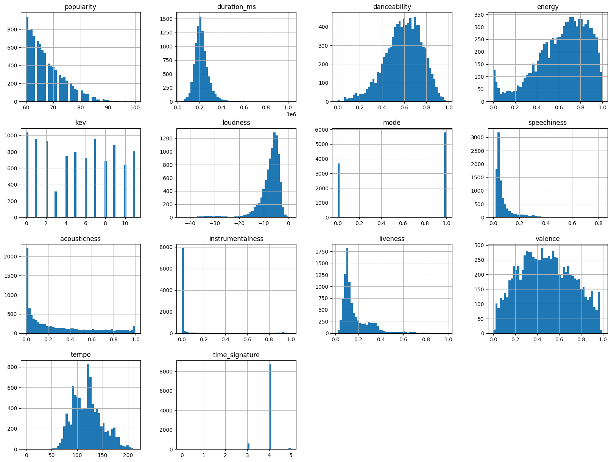

# Laporan Proyek Machine Learning - Nino Fachrurozy

## Domain Proyek

Sejak dahulu kala hingga kini, musik telah menjadi bagian yang tak terpisahkan dari peradaban manusia. Diyakini bukti tertua instrumen musik Divje Babe yang berbentuk suling tulang berumur sekitar 40.000 tahun yang lalu. Musik juga penting dalam perabadan awal manusia, seperti untuk pendekatan sosial, ritual, bahkan kelangsungan hidup [*1*].

Kini, peran musik berkembang menjadi hiburan yang dapat meningkatkan dopamin, alat mengekspresikan diri, bahkan identitas kultural [*2*]. Di era informasi ini mendengarkan musik menjadi lebih mudah dengan adanya teknologi. Pengguna pun menjadi bebas menikmati musik yang diinginkan karena perkembangan teknologi memungkinan untuk mengumpulkan banyak sekali lagu. Sebagai contoh di Spotify saja terdapat lebih dari 100 juta lagu [*3*].

Namun tidak mudah untuk memilih dari ratusan juta lagu yang tersedia, apalagi jika harus mencocokan dengan preferensi pengguna dengan latar belakang yang bermacam-macam. Sehingga dibutuhkan suatu sistem yang dapat memberikan rekomendasi lagu yang sesuai dengan selera pengguna, agar pengguna dapat menikmati musik favorit dengan mudah.

## Business Understanding

Tidak mudah untuk mengelompokkan musik karena bentuknya yang abstrak, tetapi secara umum musik dikelompokkan dalam genre, yaitu kategori konvensional yang mengelompokkan beberapa karya musik sebagai bagian dari tradisi yang sama atau berdasarkan aturan yang serupa [*4*]. Musik juga bisa dikelompokkan berdasarkan tempo, dinamika, maupun emosi.

Adanya data-data tentang musik ini memungkinkan adanya sistem rekomendasi yang mempertimbangkan hal-hal tersebut. Dengan begitu pengguna akan mendapatkan rekomendasi yang sesuai dengan preferensi mereka.

### Problem Statements

- Bagaimana cara membuat sistem rekomendasi musik yang sesuai dengan preferensi pengguna?

### Goals

- Menghasilkan rekomendasi lagu yang sesuai dengan preferensi pengguna

### Solution Statements

- Menghitung kesamaan antar lagu dalam hal genre, tempo, maupun dinamika. Kesamaan dihitung dengan menggunakan *cosine similarity*. Teknik ini disebut dengan *content-based filtering*.
- Merekomendasikan lagu yang belum pernah didengar tetapi memliki korelasi dengan lagu yang sudah pernah didengarkan. Caranya dengan membuat model untuk memprediksi berapa lama pengguna akan mendengarkan suatu lagu. Kemudian model ini akan menghitung prediksi waktu mendengarkan lagu dari lagu yang belum pernah didengar. Ini disebut dengan *collaborative filtering*.

## Data Understanding

Proyek ini menggunakan dua dataset, yaitu daftar [lagu](https://www.kaggle.com/datasets/maharshipandya/-spotify-tracks-dataset) dan [riwayat lagu yang didengar](https://www.kaggle.com/datasets/sgoutami/spotify-streaming-history). Keduanya didapat dari situs [Kaggle](https://www.kaggle.com).

Untuk selanjutnya dataset lagu ini akan disebut sebagai dataset **track**. Dataset ini berisi 114.000 baris data dengan 19 kolom seperti di bawah ini.

| Kolom | Penjelasan | Tipe Data |
|:------:|:--------------:|:-------:|
| track_id | ID lagu pada spotify | object |
| artists | Artis yang menyanyikan lagu. Jika lebih dari satu dipisahkan dengan ";" | object |
| album_name | Nama album dari lagu | object |
| track_name | Judul lagu | object |
| popularity  | Nilai popularitas lagu dalam skala 0-100 | int64 |
| duration_ms | Durasi lagu dalam *milisecond* | int64 |
| explicit | Penanda apakah lagu mengandung lirik eksplisit (kasar) | bool |
| danceability | Nilai kecocokan lagu digunakan untuk dansa, antara 0 dan 1. Semakin tinggi semakin cocok untuk berdansa | float64 |
| energy | Nilai seberapa intens energi dalam lagu, antara 0 dan 1. Semakin tinggi semakin kuat dan bersemangat | float64 |
| key | Nada dasar lagu, contoh 0=C, 1=C♯/D♭, dst. | int64 |
| loudness | Nilai seberapa keras lagu dalam desibel (dB) | float64 |
| mode | Tangga nada lagu, 1 untuk mayor, 0 untuk minor | int64 |
| speechiness | Nilai seberapa banyak perkataan dalam lagu, antara 0 dan 1. Semakin tinggi menunjukkan banyak perkataan daripada nyanyian dalam lagu | float64 |
| acousticness | Nilai seberapa akustik lagu, antara 0 dan 1 | int64 |
| instrumentalness | Nilai seberapa vokal dalam lagu, antara 0 dan 1. Semakin tinggi semakin tidak ada vokal | int64 |
| liveness | Nilai adanya penonton dalam lagu, antara 0 dan 1. Semakin tinggi menunjukkan lagu dimainkan secara langsung (*live*) | int64 |
| valence | Nilai emosi dalam lagu, antara 0 dan 1. Semakin tinggi nilai menunjukkan emosi lagu positif | int64 |
| tempo | Jumlah ketukan (*beat*) lagu dalam *beats per minute* (BPM) | float64 |
| time_signature | Tanda birama lagu | int64 |
| track_genre | Genre lagu | object |

Sedangkan dataset riwayat lagu yang didengarkan pengguna berisi 149.860 baris data dengan 10 kolom di bawah ini. Dataset ini akan disebut sebagai dataset **user**.

| Kolom | Penjelasan | Tipe Data |
|:------:|:--------------:|:-------:|
| spotify_track_uri | ID lagu pada spotify | object |
| track_name | Judul lagu | object |
| artist_name | Artis yang menyanyikan lagu | object |
| album_name | Nama album dari lagu | object |
| ts | Waktu ketika lagu selesai diputar, dalam format yyyy-MM-dd HH:mm:ss | object |
| platform | Platfrom yang digunakan untuk mendengarkan lagu | object |
| ms_played | Durasi putar lagu dalam *milisecond* | int64 |
| reason_start | Alasan mulai memutar lagu | object |
| shuffle | Penanda apakah lagu diputar dalam mode acak | bool |
| skipped | Penanda apakah lagu dilewati (*skip*) oleh pengguna | bool |

### Missing Value

Berikut adalah tabel hasil pemeriksaan data kosong pada dataset track. Dataset ini memiliki jumlah data kosong yang sangat kecil, yaitu hanya satu pada 3 kolom. Sehingga data yang bisa digunakan tidak akan berkurang signifikan.

| Kolom | Jumlah |
|:------:|:-------:|
| artists | 1 |
| album_name | 1 |
| track_name | 1 |

Sedangkan dataset user memiliki lebih banyak data kosong namun hanya pada 2 kolom. Jumlah data kosong pada dataset ini masih terbilang sedikit dibandingkan total baris keseluruhan yang mencapai ratusan ribu.

| Kolom | Jumlah |
|:------:|:-------:|
| reason_start | 143 |
| reason_end | 117 |

### Duplicate Value

Setelah diperiksa terdapat 450 baris duplikat pada dataset track dan 1.185 baris duplikat pada dataset user. Khusus untuk dataset track akan dilakukan pemeriksaan lebih lanjut untuk memastikan data yang ada benar-benar tidak terduplikat.

Pertama pemeriksaan kolom 'track_id'. Kolom ini seharusnya tidak teduplikat antar lagu karena merupakan penanda unik untuk setiap lagu. Ternyata banyak baris yang memiliki 'track_id' sama, yaitu 40.108 baris. Pemeriksaan dengan melihat salah satu ID acak menunjukkan meskipun suatu baris memiliki id sama ternyata mempunyai genre yang berbeda. Berarti dalam dataset track satu lagu bisa memiliki banyak genre.

Contohnya adalah lagu dengan ID 5SuOikwiRyPMVoIQDJUgSV berikut. Dapat dilihat bahwa lagu dengan ID ini memiliki 4 genre, namun terpisah dalam baris berbeda.

|track_id|artists|track_name|track_genre|
|:------:|:-------:|:-------:|:-------:|
|5SuOikwiRyPMVoIQDJUgSV|Gen Hoshino|Comedy|acoustic|
|5SuOikwiRyPMVoIQDJUgSV|Gen Hoshino|Comedy|j-pop|
|5SuOikwiRyPMVoIQDJUgSV|Gen Hoshino|Comedy|singer-songwriter|
|5SuOikwiRyPMVoIQDJUgSV|Gen Hoshino|Comedy|songwriter|

Pemeriksaan kedua adalah dengan membandingkan kolom 'artists', 'track_name', 'duration_ms', 'explicit', 'danceability', 'energy', 'key', 'loudness', 'mode', 'speechiness', 'acousticness', 'instrumentalness', 'liveness', 'valence', 'tempo' dan 'time_signature'. Hal ini dilakukan untuk memastikan tidak ada lagu yang sama persis walaupun memiliki ID berbeda.

Hasilnya terdapat 45.132 baris yang memiliki data-data yang sama pada kolom di atas. Contohnya pada lagu berjudul '*I'm Yours*' berikut. Terlihat lagu ini memiliki duplikasi dengan baris lain yang memiliki ID berbeda.

|track_id|artists|track_name|track_genre|
|:------:|:-------:|:-------:|:-------:|
|1EzrEOXmMH3G43AXT1y7pA|Jason Mraz|I'm Yours|acoustic|
|3S0OXQeoh0w6AY8WQVckRW|Jason Mraz|I'm Yours|acoustic|
|1EzrEOXmMH3G43AXT1y7pA|Jason Mraz|I'm Yours|rock|

Solusi untuk banyak duplikasi ini adalah dengan melakukan drop pada baris yang terduplikasi di seluruh kolom pada kedua dataset. Hasilnya tersisa 113.549 baris pada dataset track dan 148.463 baris pada dataset user. Setelah itu dilakukan drop lagi pada baris dengan elemen-elemen lagu yang sama pada dataset track seperti pada pemeriksaan kedua yang menyisakan 83.908 baris.

### Exploratory Data Analysis

Untuk efisiensi komputasi tidak seluruh data akan digunakan lebih lanjut dalam proyek ini. Dalam dataset track hanya menggunakan lagu dengan nilai popularitas minimal 60, yang menyisakan 9.488 baris. Untuk dataset user hanya akan menggunakan lagu yang terdapat dalam dataset lagu yang sudah disaring popularitasnya. Proses ini menyisakan 22.413 baris pada dataset user. Setelah itu dilakukan analisis terhadap data-data ini.

Di dalam dataset track yang sudah disaring terdapat 102 genre dengan jumlah lagu pada tiap genre yang bervariasi. Analisis wordcloud berikut menunjukkan genre mana saja yang dominan.

Dapat dilihat dari wordcloud bahwa genre seperti k-pop, hip-hop, alt-rock, pop-film dan chill dominan. Untuk mengetahui detail jumlah lagu tiap genre dapat dilihat dari grafik dari 10 genre dengan jumlah lagu terbanyak di bawah ini.

Grafik ini menunjukkan genre k-pop memiliki lagu terbanyak, disusul pop-film dan hip-hop, yang mana sekitar 10% dari dataset track merupakan tiga genre teratas ini. Genre pop dan hip-hop merupakan dua genre teratas di tahun 2024, sedangkan k-pop menunjukkan pertumbuhan sebagai salah satu genre non-bahasa Inggris [*5*].

Namun hasil berbeda ditunjukkan jika menghitung genre yang paling lama didengarkan berdasarkan dataset user yang juga telah disaring. Dalam dataset user ini, pengguna mendengarkan genre british lebih lama dari genre lain. Di bawahnya terdapat genre singer-songwriter, alt-rock, garage dan blues dengan selisih yang jauh dari genre british. Detail 10 genre yang paling lama didengarkan dapat dilihat pada grafik di bawah ini.

Untuk mengetahui distribusi data bisa dilakukan analisis melalui grafik histogram. Berikut adalah grafik histogram dari dataset track.

Analisis histogram dari dataset track menunjukkan beberapa poin berikut:

- Semakin tinggi popularitas, semakin sedikit jumlah lagu
- Dataset didominasi oleh lagu penuh nyanyian (speechiness rendah), bukan instrumental (instrumental rendah), bukan lagu akustik (acousticness rendah), serta tidak ditampilkan secara *live* (liveness rendah)
- Hampir seluruh lagu memiliki tanda birama 4/4 yang umum digunakan pada lagu pop. Hal ini bisa terjadi karena dataset track telah disaring menjadi hanya lagu-lagu populer
- Distribusi key hampir merata, dengan pengecualian nada dasar D# yang lebih kecil dari nada dasar lain
- Durasi lagu, valence, danceability, dinamika, serta tempo terdistribusi normal

## Data Preparation

### Formatting

Pada dataset track, baris genre yang masih terpisah digabung dalam satu string sehingga dalam satu ID lagu memiliki banyak genre yang dipisahkan oleh tanda spasi. Selain itu jika terdapat tanda '-' pada genre maka akan dihilangkan.

### Feature Engineering

Proses ini dilakukan dengan membuat kolom baru bernama 'content' dengan tipe string pada dataset track. Kolom ini pada dasarnya adalah konten yang menggambarkan karakter dari suatu lagu. Ini berguna dalam pembangunan sistem *content-based filtering*. Kolom ini akan dibentuk oleh gabungan dari data genre yang telah digabung, 'speechiness', 'instrumentalness', 'tempo', 'mode', 'loudness', dan 'explicit'. Karena data-data tersebut selain genre masih berbentuk numerik dan boolean, maka akan diubah dulu ke dalam bentuk string.

#### Speechiness

Mengatur string menjadi "speech" jika nilai lebih dari 0.66, selain itu akan menjadi "music".

#### Instrumentalness

Untuk nilai lebih dari 0.85 akan diisi "instrumental", selain itu diisi "vocal".

#### Explicit

Diisi "explicit" jika bernilai True, jika False menjadi "clean".

#### Mode

Diisi "mayor" untuk nilai 1 dan "minor" untuk nilai 0.

#### Loudness

Penanda seberapa keras suara dalam lagu.

- Lebih dari -7 dB: stentorian
- Di antara -7 dB dan -11 dB: loud
- Di antara -11 dB dan -14 dB: normal
- Di bawah -14 dB: quiet

#### Tempo

Dibentuk sesuai kategori tempo dalam musik [*6*] sebagai berikut:

- Kurang dari 40 BPM: grave
- 40-45 BPM: lento
- 45-55 BPM: largo
- 55-65 BPM: adagio
- 65-69 BPM: adagietto
- 69-77 BPM: andante
- 77-98 BPM: moderato
- 98-109 BPM: allegretto
- 109-132 BPM: allegro
- 132-140 BPM: vivace
- 140-177 BPM: presto
- Lebih dari 177 BPM: prestissimo

Sedangkan pada dataset user karena tidak ada penanda ID untuk pengguna maka akan dibuat kolom bernama 'user_id'. Proses ini dilakukan dengan mengatur 180 nomor acak pada setiap baris, lalu nomor ini diubah menjadi string dengan format 'U00' dan diikuti nomor acak tersebut. Sehingga dataset user terbagi ke dalam 180 pengguna berbeda.

### Encoding

Proses ini hanya dilakukan pada dataset user dengan mengubah ID user dan ID lagu ke dalam urutan angka dari 1 hingga jumlah ID yang ada, misal ID user akan diubah menjadi angka 1 hingga 180.

### Scaling

Proses ini juga hanya dilakukan pada dataset user, dengan mengubah semua nilai 'ms_played' dalam skala antara 0 dan 1. Nilai diubah ke dalam skala dengan membagi selisih antara nilai dan nilai terkecil dalam dataset dengan seliish nilai terbesar dan terkecil.

### Train-test Split

Dataset user dibagi menjadi data training dan validation dengan proporsi 80:20.

## Modeling

### Cosine Similarity

Teknik ini biasa digunakan dalam sistem *content-based filtering* yang bekerja dengan menghitung kesamaan antar item. Item akan direpresentasikan sebagai vektor, lalu untuk setiap pasang vektor akan dihitung kemiripan arah dan sudutnya. Berikut adalah rumus cosine similarity.

Kelebihan teknik ini adalah efektif untuk data jarang serta efisien secara sumber daya. Namun kekurangannya hanya memberikan item yang mirip tanpa mempertimbangkan seberapa pengguna menyukai item tersebut [*7*].

Dalam proyek ini item berupa karakteristik lagu dalam kolom 'content' akan diukur menggunakan TF-IDF (Term Frequency-Inverse Document Frequency) yang mengukur seberapa penting suatu kata dalam dokumen. Lalu semua lagu akan dihitung kesamaannya terhadap lagu lain menggunakan cosine similarity. Semakin mirip data dalam 'content' maka semakin besar nilainya. 5 lagu dengan kemiripan tertinggi terhadap satu lagu yang ditentukan akan dipilih sebagai rekomendasi.

Contohnya jika model diminta untuk memberikan rekomendasi berdasarkan lagu ini.

|track_id|artists|track_name|content|
|:------:|:-------:|:-------:|:-------:|
|10rChmECwPcvTTj4w07hq4|Simple Plan|Welcome to My Life|music vocal presto major stentorian clean punkrock punk|

Model akan memberikan daftar rekomendasi berikut.

|track_id|artists|track_name|content|similarity|
|:------:|:-------:|:-------:|:-------:|:-------:|
|7sziTn5nHwrWf4K7gISaaU|Simple Plan;Sean Paul|Summer Paradise (feat. Sean Paul) - Single Ver...|music vocal presto major stentorian clean punkrock punk|1.000000|
|371Tb0eNfpjpSqggjcLv8c|All Time Low|Therapy|music vocal presto major stentorian clean punkrock punk|1.000000|
|2m1hi0nfMR9vdGC8UcrnwU|blink-182|All The Small Things|music vocal presto major stentorian clean punkrock punk|1.000000|
|4NnWuGQujzWUEg0uZokO5M|The Cure|Just Like Heaven|music vocal presto major stentorian clean punkrock punk|1.000000|
|0I329vpTJRdSRjEcWaQsSL|Simple Plan;Natasha Bedingfield|Jet Lag (feat. Natasha Bedingfield)|music vocal presto major stentorian clean punkrock punk|1.000000|

### Dot Product

Dot product adalah suatu operasi untuk mengalikan dua vektor sehingga menghasilkan nilai skalar [*8*]. Berbeda dengan cosine similarity, teknik ini tidak hanya mempertimbangkan arah dan kemiringan vektor tetapi juga panjangnya. Sehingga teknik ini cocok dipakai untuk mengukur prefensi pengguna. Oleh karena itu sering digunakan pada sistem *collaborative filtering*. Berikut adalah rumus dot product.

Dalam proyek ini akan digunakan model neural network untuk memproses dataset user yang sudah melalui proses encoding. Data ini akan diubah menjadi vektor menggunakan layer embedding. Lalu dilakukan penghitungan dot product dari tiap data pengguna dan lagu ini. Hasil dot product ditambah dengan bias, lalu diproses dengan fungsi aktivasi sigmoid untuk menentukan kesamaan preferensi antara satu user dengan user lainnya. Model dilatih dengan 10 epoch. Berikut diagram proses training model setiap epochnya.

Setelah model terbentuk, model dicoba untuk memberikan rekomendasi berdasarkan pengguna dengan ID U00007. Pengguna ini paling lama mendengarkan 5 lagu berikut.

|track_id|artists|track_name|track_genre|ms_played|
|:-------:|:-------:|:-------:|:-------:|:-------:|
|5hhVpGIBlqAU5yJEOmrk5o|Led Zeppelin|All My Love - Remaster|hardrock|353720|
|1BLOVHYYlH4JUHQGcpt75R|The Strokes|Ode To The Mets|altrock garage|351786|
|70C4NyhjD5OZUMzvWZ3njJ|Billy Joel|Piano Man|folk piano singersongwriter songwriter|339000|
|78WVLOP9pN0G3gRLFy1rAa|Billy Joel|Piano Man|piano|336200|
|2oaK4JLVnmRGIO9ytBE1bt|Red Hot Chili Peppers|Dark Necessities|altrock alternative funk metal|302000|

Jika waktu mendengarkan dihitung berdasarkan genre, maka berikut adalah 5 genre yang paling lama didengar.

|genre|ms_played|
|:-------:|:-------:|
|psychrock|2728243|
|singersongwriter|2011089|
|songwriter|2011089|
|rock|1975291|
|british|1958405|

Setelah menghitung prediksi durasi mendengar terhadap lagu-lagu yang belum pernah didengar, berikut adalah hasil 5 rekomendasi lagu untuk pengguna ID U00007.

|track_id|artists|track_name|track_genre|
|:-------:|:-------:|:-------:|:-------:|
|3qiyyUfYe7CRYLucrPmulD|The Who|Baba O'Riley|blues british hardrock psychrock|
|1Ud6moTC0KyXMq1Oxfien0|The Rolling Stones|Sympathy For The Devil - 50th Anniversary Edition|british|
|2ksOAxtIxY8yElEWw8RhgK|Anuel AA;Daddy Yankee;KAROL G;J Balvin;Ozuna|China|latino reggae reggaeton|
|5p3JunprHCxClJjOmcLV8G|Lou Reed|Walk On the Wild Side|psychrock|
|5gbxzSqABThINGDb7vIiwe|John Mayer|Edge of Desire|singersongwriter songwriter|

Model memberikan beberapa rekomendasi dengan genre yang sering didengar oleh pengguna sebelumnya, seperti british, psychrock, atau songwriter. Tetapi terdapat juga rekomendasi lagu dengan genre lain seperti latino.

## Evaluation

Proyek ini akan menggunakan 2 metrik evaluasi yang berbeda untuk 2 model. Model *content-based filtering* yang dibuat menggunakan *cosine similarity* akan diukur menggunakan metrik *Precision at K*, sedangkan model *collaborative filtering* diukur dengan Root Mean Square Error (RMSE).

*Precision at K* adalah metrik yang menghitung rasio item rekomendasi yang relevan dengan membagi jumlah item yang relevan dengan jumlah total item rekomendasi yang dilambangkan sebagai K. Model *cosine similarity* yang sudah dibuat memberikan 5 rekomendasi lagu yang seluruhnya memiliki data content "*music vocal presto major stentorian clean punkrock punk*". Input lagu juga memiliki data content yang sama persis. Sehingga nilai *Precision at 5* untuk model ini adalah 5/5, atau **100%**.

Sedangkan RMSE bekerja dengan menghitung selisih kuadrat setiap data, lalu menghitung rata-rata dari semua selisih kuadrat. Setelah itu nilai ini akan dikuadratkan untuk mendapat nilai *error*. Metrik ini dipilih karena mudah dipahami, nilai  metrik ini memiliki satuan yang sama dengan variabel target *[9]*. Perhitungan RMSE terhadap data testing pada dataset user menunjukkan hasil RMSE sebesar **177.973,790**, yang berarti rata-rata prediksi durasi mendengarkan menyimpang 177.973 milisecond (≈3 menit) dari data sebenarnya.

## Referensi

[1] Morley, I. (2013). [*The Prehistory of Music: Human Evolution, Archaeology, and the Origins of Musicality*](https://academic.oup.com/book/9285). Oxford: Oxford University Press.
[2] Welch et al. (2020). [*Editorial: The Impact of Music on Human Development and Well-Being*](https://www.frontiersin.org/journals/psychology/articles/10.3389/fpsyg.2020.01246/full). Frontiers in Psychology. 11.
[3] Spotify. (2022). [*About Spotify*](https://newsroom.spotify.com/company-info/#:~:text=Today%2C%20more%20listeners%20than%20ever,a%20la%20carte%20on%20Spotify.). Diakses 19 Mei 2025.
[4] Samson, J. (2001). [*Genre*](https://www.oxfordmusiconline.com/grovemusic/display/10.1093/gmo/9781561592630.001.0001/omo-9781561592630-e-0000040599). Grove Music Online.
[5] Charmetric. (2024). [*Chartmetric Year in Music 2024*](https://reports.chartmetric.com/2024/chartmetric-year-in-music-2024). Diakses 21 Mei 2025.
[6] Symphony Nova Scotia. (2025). [*How do musicians know how fast to play a piece? And why are the terms in Italian?*](https://symphonynovascotia.ca/faqs/symphony-101/how-do-musicians-know-how-fast-to-play-a-piece-and-why-are-the-terms-in-italian/). Diakses 21 Mei 2025.
[7] Noori et al. (2024). [*Matrix Factorization and Cosine Similarity Based Recommendation System For Cold Start Problem in E-Commerce Industries*](https://iiict.uob.edu.bh/IJCDS/papers/IJCDS150156_1570934223.pdf). International Journal of Computing and Digital Systems. 1, 775-787.
[8] Subasi et al. (2022). [*Chapter 7 - Deep learning approaches for the cardiovascular disease diagnosis using smartphone*](https://www.sciencedirect.com/science/article/abs/pii/B9780323905480000103). 5G IoT and Edge Computing for Smart Healthcare. 163-193.
[9] Hodson, O. T. (2022). [*Root-mean-square error (RMSE) or mean absolute error (MAE): when to use them or not*](https://gmd.copernicus.org/articles/15/5481/2022/). Geoscientific Model Development. 15, 5481–5487.
